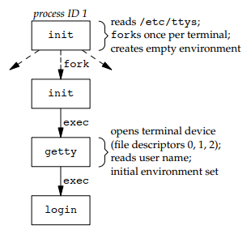
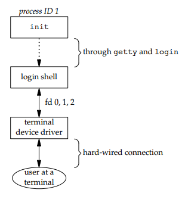
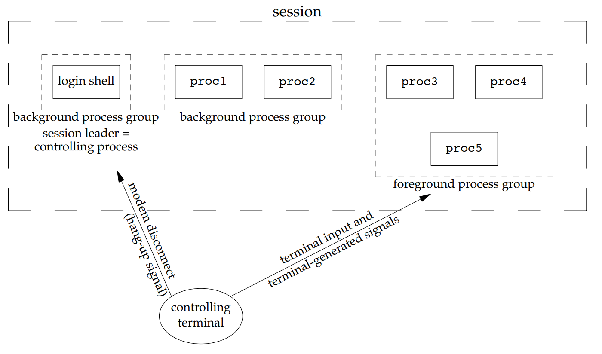
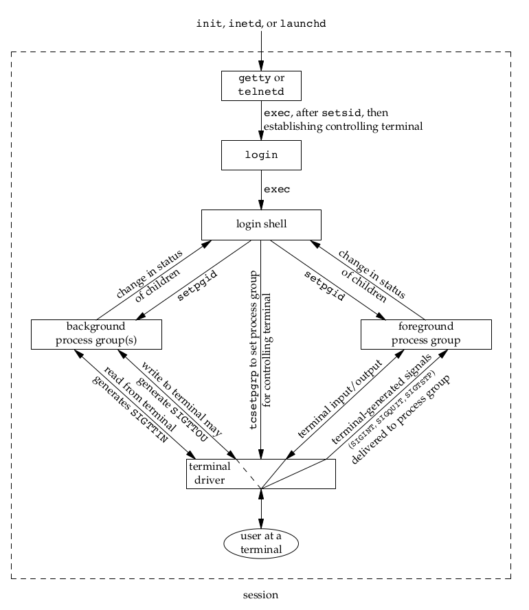

除了了解操作系统，学会各种命令行工具的用法，作为程序员还需要了解操作系统提供的各种 API，同时还将会了解到 Linux 内核等知识。

由于 Unix 系统对其他操作系统有重大影响，因此本章将会以 Unix 环境下 C 语言编程作为核心要点，广泛的介绍一切和内核、接口编程有关的概念。由于操作系统不可避免的涉及到网络、C 编程相关的知识，因此本章也是网络、编程部分功能实现的底层参考。
<!-- more -->

# Unix 简介 

# 系统函数
系统调用通常提供一种最小接口，而库函数通常提供比较复杂的功能。进程控制系统调用 (fork, exec 和 wait) 通常由用户应用程序直接调用，然而内存分配系统调用 sbrk 却鲜被直接使用，通常程序员会使用功能更加丰富的 malloc 库函数，而后者的实现中使用了 sbrk 系统调用。

因此，实际中我们不得不既使用系统调用，又使用某些库函数，然而对于一个函数来说，它究竟是系统调用还是库函数对于使用者来说是无感的，因此除了必须要区分两者时，本文对系统调用和库函数都使用**系统函数 (funcition)** 这一术语来表示。

如下是一份系统函数的速查表。

## 文件 I/O (File I/O)

系统函数|描述|头文件
---|---|---
open |打开或创建一个文件|<fcntl.h>
creat|创建一个文件（不推荐使用）|<fcntl.h>
read |从打开文件中读数据|<unistd.h>
write|向打开文件中写数据|<unistd.h>
lseek|显式地为一个打开文件设置偏移量|<unistd.h>
close|关闭一个打开文件|<unistd.h>
dup|复制一个现有的文件描述符|<unistd.h>
dup2|复制一个现有的文件描述符|<unistd.h>
sync|保证磁盘上实际文件系统与缓冲区中内容的一致性|<unistd.h>
fsync|保证磁盘上实际文件系统与缓冲区中内容的一致性|<unistd.h>
fdatasync|保证磁盘上实际文件系统与缓冲区中内容的一致性|<unistd.h>
fcntl|改变己经打开文件的属性|<fcntl.h>
ioctl|I/O操作的杂货箱|<unistd.h> in System V  <sys/ioctl.h> in BSD or Linux

## 文件和目录
系统函数|描述|头文件
---|---|---

## 标准 I/O
系统函数|描述|头文件
---|---|---

## 系统数据文件和信息
Unix 系统的正常运作需要使用大量与系统有关的数据文件

系统函数|描述|头文件
---|---|---

## 进程环境
系统函数|描述|头文件
---|---|---

## 进程控制
系统函数|描述|头文件
---|---|---

## 进程关系
系统函数|描述|头文件
---|---|---
getpgrp|返回调用进程的进程组 ID

## 信号
系统函数|描述|头文件
---|---|---

## 线程
系统函数|描述|头文件
---|---|---

## 线程控制
系统函数|描述|头文件
---|---|---

## 守护进程
系统函数|描述|头文件
---|---|---

## 高级 I/O
系统函数|描述|头文件
---|---|---

## 进程间通信
系统函数|描述|头文件
---|---|---

# 进程控制
## clone 系统调用

clone() 系统调用的基本用法如下：


/* Prototype for the glibc wrapper function */
#define _GNU_SOURCE
#include <sched.h>

int clone(int (*fn)(void *), void *child_stack,
                int flags, void *arg, ...
                /* pid_t *ptid, void *newtls, pid_t *ctid */ );


成功时，调用者的进程中将会返回子进程的 thread ID；失败时返回 -1，子进程将不会被创建，同时将会触发 ERROR。

clone() 创建新进程，其行为类似于 fork()，通常使用 glibc 库中的包装函数 clone()，该函数基于 clone 系统调用。与 fork 不同，clone 允许子进程与父进程共享部分执行上下文的参数，例如虚拟地址空间、文件描述符表、信号处理程序等。

fork 是标准的 Unix 系统调用，用来创建进程，而在 Linux 中 clone 可以根据传递的选项创建不同的执行线程，新的执行线程可以遵循 UNIX 进程、POSIX 线程、介于两者之间或完全不同的事物（例如不同的容器）的语义。`pthread_create()` 和 `fork()` 底层实现都使用了 `clone()`。 

通过 clone() 创建的子进程，从调用指向的函数 fn() 开始执行，而 fork() 创建的子进程将会从 fork 的调用点开始执行。当 fn(arg) 函数返回，子进程结束，函数 fn 的返回值就是子进程的退出状态码，子进程同样可以通过调用 exit() 和收到结束信号而显式结束。

child_stack 参数指定了子进程使用的栈，子进程不可以与父进程共享栈空间，由于绝大部分 Linux 的处理器的栈都是向下生长的，因此该参数需要指向栈顶空间。

flags 的最低字节指定了当子进程结束时需要发送给父进程的结束信号。如果该信号不是 SIGCHLD，则父进程在调用 wait() 等待子进程时必须指定 `__WALL` 或 `__WCLONE` 选项；如果未指定，则子进程退出时父进程将不会收到任何信号。

flags 还可以与零个或多个常量进行按位或运算，以指定在调用进程和子进程之间共享的内容，具体的常量可以查看 man 文档。

# 进程关系
当子进程终止时，父进程得到通知并能取得子进程的退出状态。

## 终端登录

## 进程组
每个进程除了有一进程 ID 之外，还属于一个进程组。进程组是一个或多个进程的集合。
同一进程组中的各进程接收来自同一终端的各种信号。
每个进程组有一个唯一的进程组ID

## 会话
会话 (session) 是一个或多个进程组的集合。
通常是由 shell 的管道将几个进程编成一组的。


$ proc1 | proc2 &
$ proc3 | proc4 | proc5


1. 该进程变成新会话的会话首进程 (session leader，会话首进程是创建该会话的进程)。此
时，该进程是新会话中的唯一进程。
2. 该进程成为一个新进程组的组长进程。新进程组 ID 是该调用进程的进程 ID。
3. 该进程没有控制终端(下一节讨论控制终端)。如果在调用setsid之前该进程有一个
控制终端，那么这种联系也被切断。

# 用户空间与内核的接口
内核通过各种不同的接口把内部信急输出到用户空hl
- 系统调用
- procfs 这是个虚拟文件系统，通常是挂载到 /proc:，允许内核以文件的形式向用户空间输出内部信息，这些文件并没有实际存在于磁盘中，但是可以通过 cat 以及 > shell 重定向运算符写入。
- sysctl /proc/sys 此接口允许用户空间读取或修改内核变量的值。

ioctl 系统调用
- Netlink 套接字 这是网络应用程序与内核通信时最新的首选机制，IPROUTE2 包中大多数命令都使用此接口。对 Linux 而言，Netlink 代表的就是 BSD 世界中的路由套接字 (routing socket)。

# Netlink
- https://stackoverflow.com/questions/862964/who-can-give-me-the-latest-netlink-programming-samples

# 内核模块 (Kernel Module)
内核模块是可以根据需要加载和卸载到内核中的代码段，它们扩展了内核的功能，但无需重新引导系统。

## 简介
### 获取信息
通过运行 `lsmod` 来查看哪些模块已经加载到内核中，该模块通过读取文件 `/proc/modules` 获取其信息。内核模块存储在 `/usr/lib/modules/kernel_release` 或者 `/lib/modules/kernel_release`，可以通过 `uname -r` 获取内核的版本。

以下是一些常用的命令：


$ lsmod                                 # 查看哪些模块已经加载到内核中
$ modinfo module_name                   # 显示有关模块的信息
$ modprobe -c | less                    # 显示所有模块的完整配置
$ modprobe -c | grep module_name        # 显示特定模块的完整配置
$ modprobe --show-depends module_name   # 列出模块的依赖项（包括模块本身）


### 自动加载机制
今天，udev 会自动处理所有必需的模块加载，因此不需要特别的进行配置。需要加载的内核模块在 `/etc/modules-load.d/` 下的文件中明确列出，以便 systemd 在引导过程中加载它们。每个配置文件均以 `/etc/modules-load.d/<program>.conf` 的样式命名。

### 手动加载机制
模块如何手动载入入内核呢？当内核需要内核中不存在的功能时，内核模块守护程序 `kmod` 会执行 `modprobe` 来加载/卸载模块。`modprobe` 需要以下两种形式之一的字符串作为参数：
- 模块名称 (A module name like softdog or ppp.)
- 模块标识符 (A more generic identifier like char−major−10−30.)

除此之外，还可以通过 `insmod` 来加载模块，通过 `rmmod` 来卸载模块。模块的加载和卸载均需要管理员权限。


$ modprobe module_name
$ insmod filename [args]    # 不在标准目录下的内核文件，可以通过文件名加载。



$ modprobe -r module_name
$ rmmod module_name


## Hello world 模块
[How to use netlink socket to communicate with a kernel module?](https://stackoverflow.com/questions/3299386/how-to-use-netlink-socket-to-communicate-with-a-kernel-module) 有一份示例代码，包括两部分：
- Kernel module
- User program

其中内核模块程序可以通过以下 Makefile 编译链接，然后通过 `insmod hello.ko` 来载入。


obj-m = hello.o
KVERSION = $(shell uname -r)
all:
    make -C /lib/modules/$(KVERSION)/build M=$(PWD) modules
clean:
    make -C /lib/modules/$(KVERSION)/build M=$(PWD) clean


# Netfilter 网络框架
Netfilter 是 Linux 内核中的一个软件框架，用于管理网络数据包。不仅具有网络地址转换的功能，也具备数据包内容修改以及数据包过滤等防火墙功能。Netfilter 在 Linux 网络堆栈中引入了五个挂载/钩子函数 (hook) 以在不同阶段执行数据包处理，内核模块可以向钩子注册回调函数，当数据流量经过这些钩子时候将会调用这些函数，从而完成对流量的控制。

详细内容可见     

# 负载均衡 (LVS)
Linux Virtual Server (lvs) 是 Linux 内核自带的负载均衡器，也是目前性能最好的软件负载均衡器之一。LVS 包括 ipvs 内核模块和 ipvsadm 用户空间命令行工具两部分。

在 LVS 中，节点分为 Director Server 和 Real Server 两个角色，其中 Director Server 是负载均衡器所在节点，而 Real Server 则是后端服务节点。

详细内容可见  

# 流量控制 (TC)
流量控制 (Traffic Control, TC) 是 Linux 内核提供的流量限速、整形和策略控制机制。它以 qdisc-class-filter 的树形结构来实现对流量的分层控制。

详细内容可见  

# 参考
- [SDN handbook](https://tonydeng.github.io/sdn-handbook/)
- [What is the difference between Unix, Linux, BSD and GNU?](https://unix.stackexchange.com/questions/104714/what-is-the-difference-between-unix-linux-bsd-and-gnu)
- [The Linux Kernel documentation](https://www.kernel.org/doc/html/latest/)
- [Netfilter](https://en.wikipedia.org/wiki/Netfilter)
- [a-deep-dive-into-iptables-and-netfilter-architecture](https://www.digitalocean.com/community/tutorials/a-deep-dive-into-iptables-and-netfilter-architecture)
- [POSIX Threads Programming](https://computing.llnl.gov/tutorials/pthreads/)
- [Introduction to Linux interfaces for virtual networking](https://developers.redhat.com/blog/2018/10/22/introduction-to-linux-interfaces-for-virtual-networking/)